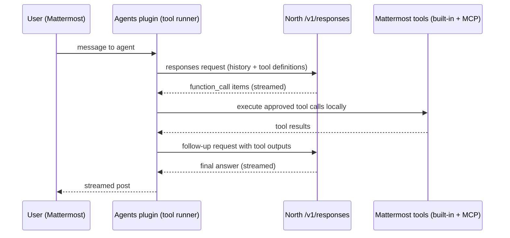
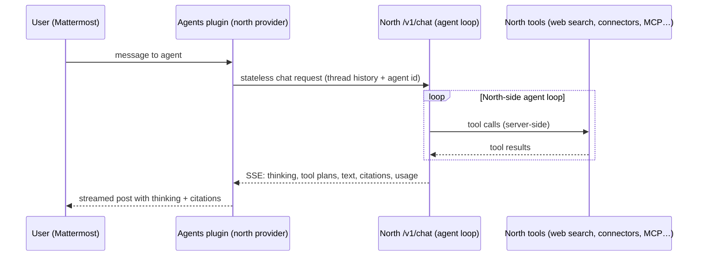
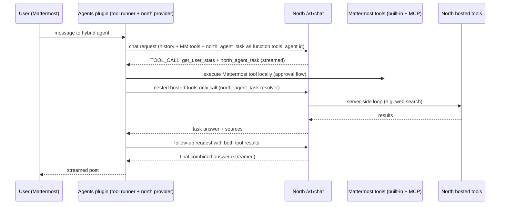

# Cohere North Integration (POC)

This document describes how the Mattermost Agents plugin integrates with [Cohere North](https://cohere.com/north), Cohere's enterprise agents platform. North hosts models (e.g. North Large, Command A), agents with server-side tools (web search, data interpreter, connectors, MCP servers), and per-user permissions.

The plugin supports three integration shapes that differ in **where the agent loop runs and which tools are available**:

| | Mode A: OpenAI-compatible | Mode B: Full delegation | Mode B hybrid: One agent, both toolsets |
|---|---|---|---|
| Service type | **OpenAI Compatible** (existing) | **Cohere North** (new, experimental) | **Cohere North**, with tools enabled on the Mattermost agent |
| North endpoint used | `/api/v1/responses` (Open Responses spec) | `/api/v1/chat` (North native chat) | `/api/v1/chat`, with the Mattermost tool catalog as function tools |
| Agent loop runs in | **Mattermost** (the plugin's tool runner) | **Cohere North** (server-side) | **Mattermost** coordinates rounds; North executes hosted work inside the `north_agent_task` bridge |
| Tools available | Mattermost built-in + MCP tools, executed locally with the plugin's approval flow | The North agent's hosted tools (web search, data interpreter, connectors, North MCP servers), executed inside North | **Both**: Mattermost tools locally, plus the North agent's hosted tools via the bridge tool |
| North serves as | The model behind the plugin's own agent | The complete agent: model + tools + loop | The agent persona/model, plus a hosted-tools executor |
| Conversation state | Rebuilt by the plugin from the Mattermost thread each turn | Same (requests are stateless; the full thread is resent) | Same |
| Reasoning/citations | Reasoning summaries via the Responses API | North thinking, tool plans, and tool activity surface in the Mattermost "thinking" UI; North citations render as citation annotations | Same as Mode B; bridge results carry source URLs |
| Plugin code changes | None — configuration only | `north/` provider package | `north/` provider + `north_agent_task` built-in tool |

All shapes can coexist: configure the services once and choose per Mattermost agent.

## Mode A — North as an OpenAI-compatible model

North implements the [Open Responses specification](https://www.openresponses.org/) at `POST /v1/responses`, which is the same API the plugin already speaks for OpenAI-compatible services when **Use Responses API** is enabled. The plugin's agent loop works unchanged: the model requests function calls, the plugin executes Mattermost tools locally (with the usual approval flow), and results are sent back until the model produces a final answer.

### Configuration

1. In the System Console Agents panel, add a service with type **OpenAI Compatible**.
2. **API URL**: your North instance's API base URL, e.g. `https://your-north-host/api`. (A trailing `/v1` is tolerated; the plugin issues requests to `<url>/v1/responses`.)
3. **API Key**: a North API token. For a quick start, use the token from your North instance's `/developer` page; for production, use a North service account or OAuth token — see the security notes below.
4. **Use Responses API**: **enabled** (required — North does not implement the legacy Chat Completions API).
5. **Default model**: a model name available on your North instance (e.g. `command-a-03-2025`). Note that North's `/v1/models` endpoint lists model *deployments*, not the underlying model names; ask your North operator which model names are routable.
6. Set token limits and a generous streaming timeout (e.g. 120 s), then create a Mattermost agent on this service with tools enabled.

## Mode B — Full delegation to a North agent

The **Cohere North** service type sends each turn to North's native chat API and lets North run the whole agent loop server-side. The plugin acts as a thin client:

- The Mattermost thread is mapped to North chat messages and sent as a **stateless** request, so the plugin's normal thread reconstruction, regeneration, and editing behavior keep working.
- The configured **North agent ID** (stored in the service's/agent's model field) selects which North agent handles the request; its preamble, model, temperature, and attached tools all live in North. Leave it blank to use the instance's default agent.
- North's server-side activity is surfaced in Mattermost: thinking content and tool plans stream into the "thinking" UI, tool invocations are narrated there, and North citations with source URLs render as citation annotations on the post.
- The provider never emits tool-call events, so the plugin's tool runner completes after a single call. Mattermost-side tools are intentionally out of the picture; create delegated agents with tools disabled.

### Configuration

1. Create (or pick) an agent on your North instance and note its agent ID (`GET /api/v1/agents`, or create one with `POST /api/v1/agents`).
2. In the System Console Agents panel, add a service with type **Cohere North (Experimental)**:
   - **API URL**: `https://your-north-host/api`
   - **API Key**: a North API token
   - **North agent ID**: the agent to delegate to (blank = instance default agent)
   - **Streaming Timeout Seconds**: idle timeout between stream events; North agent loops can run long, so 120 s is a reasonable floor.
3. Create a Mattermost agent on this service with **tools disabled**. A per-agent "model" override, when set, is interpreted as a different North agent ID.

## Hybrid — one agent combining Mattermost and North capabilities

Enabling **tools** on a Mattermost agent that uses the **Cohere North** service switches it into hybrid mode: a single agent with the North agent's persona that can use Mattermost tools *and* the North agent's hosted tools in the same conversation — even in the same round.

North's native chat API accepts client-executed `function` tools together with `agent:{id}` (the agent's preamble and model still apply), but it **rejects mixing hosted and function tools in one request** (`CANNOT_MIX_CUSTOM_AND_MANAGED_TOOLS`), and passing function tools deactivates the agent's hosted tools for that call. The provider therefore combines the two toolsets across *two paths*:

- The **Mattermost tool catalog** (built-in + MCP) is forwarded as function tools. When North returns tool calls, the plugin's tool runner executes them locally with the normal approval flow and sends results back for the next round.
- The **North agent's hosted tools** are reached through a built-in bridge tool, **`north_agent_task`**, that the plugin adds to the catalog of North-backed agents whose North agent has hosted tools (discovered via `GET /v1/agents/{id}` and cached). Its resolver performs a nested, hosted-tools-only North call — the North agent runs its own server-side loop (web search, scraping, code execution, connectors) and returns the final answer with source URLs, which flows back into the outer loop as a tool result.

### Configuration

1. Use the same **Cohere North** service as Mode B (the North agent ID selects the persona *and* the hosted toolset).
2. Create the Mattermost agent with **tools enabled**. Recommended: add custom instructions that tell the model when to use `north_agent_task` (e.g. "you have the north_agent_task tool for live web search, URL scraping, and code execution; use it whenever current or external information is needed") — with large tool catalogs, models pick the bridge far more reliably when it is named in the instructions.
3. Tool approvals behave as usual: both Mattermost tools and `north_agent_task` show the standard approval UI where policy requires it.

### Hybrid caveats

- The bridge only appears when a **North agent ID** is configured and that agent has hosted tools; the nested task runs without the outer conversation's context, so the model is instructed to write self-contained tasks.
- North function-tool schema validation is strict (object schemas must carry a `properties` key); the provider normalizes schemas accordingly.
- A production-clean alternative that avoids the bridge entirely: register Mattermost's embedded MCP server *in North*, making Mattermost tools North-managed tools. That keeps one server-side loop with both toolsets but requires North admin access and inbound network reachability from North to Mattermost.

## Choosing a mode

- Use **Mode A** when the agent should act on Mattermost data and tools (channel search, MCP servers registered in Mattermost) with Mattermost's approval flow, and North supplies the model.
- Use **Mode B** when the value lives in North — its enterprise connectors, permissions-aware search, data interpreter, and curated agents — and Mattermost is the conversational surface.
- Use the **hybrid** (Mode B with tools enabled) when one agent should seamlessly combine both: North persona and hosted capabilities plus Mattermost workspace tools in the same conversation.

## Security and production notes

- **Credential scope**: in both modes every Mattermost user of the agent shares one North credential, so North sees a single identity. North applies that identity's permissions to tool and data access. Production deployments that need per-user data boundaries should exchange per-user tokens via North's OAuth/token-exchange flows instead of a shared token; that is future work for this POC.
- **Token lifetime**: tokens from North's `/developer` page are user JWTs with a limited lifetime and will need rotation. Prefer North service accounts / federated identities for anything long-lived.
- **Prompt privacy**: North's native stream can include `debug` events carrying the fully rendered prompt. The provider drops these events; they are never written to Mattermost posts.

## POC limitations (future work)

- Mode B and the hybrid forward text only: file attachments and images are not mapped onto North's multimodal inputs.
- North tool approvals and MCP elicitations are not surfaced in Mattermost; tools that require interactive approval inside North will not complete.
- North conversation state is not reused across turns (the thread is resent statelessly). Mapping Mattermost threads to North `conversation` IDs would enable North-side history features.
- Structured-output requests (used by some internal plugin operations) rely on the plugin's prompt-based fallback rather than a native North JSON mode.
- The hosted-tool list behind the bridge is cached for a few minutes; newly enabled North tools appear after the cache expires.
- Exposing a North agent as a tool for *any* Mattermost agent (not just North-backed ones) would generalize the bridge; registering Mattermost's MCP server in North is the server-side equivalent.
